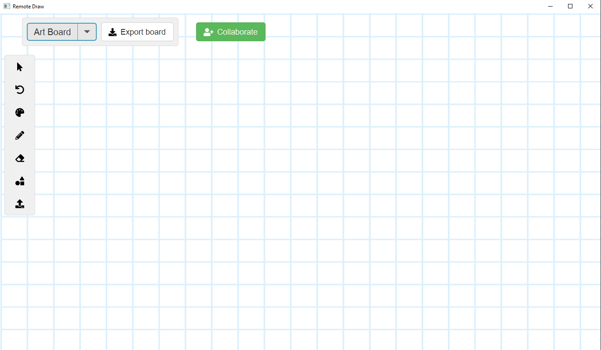

# Remote Draw Application
Project Description
# Definition
The drawing board provides users abilities to customize their drawings; we could find out some applications such as Windows Paint, Artweaver, GIMP… However, these programs only available for one user at the time. <b>Remote Draw</b> can allow multiple users to draw on board simultaneously through a local network like cable connection, Wifi, or Bluetooth.
# Drawing Class Diagram
  
  - <b>Description</b>:
    + DrawingMode: Define functions of application
    + Infrastructure: Define essential information about drawing and connection of the application
    + Shape: Define any shape that is drew on the canvas
    + Rectangle: Define any rectangle that is drew on the canvas
    + Ellipse: Define any ellipse that is drew on the canvas
    + Stroke: Define any stroke that is drew on the canvas
    + Eraser: Define any eraser that is drew on the canvas
    + Drawing: Store and draw graphic elements like shape and stroke to the canvas
# Technologies:
 - Programming language: Java
 - Framework: JavaSDK 11, JavaFX 13
 - Platform: Windows, Linux
# Features
- Drawing abilities:
  + Select
  + Undo
  + Change color
  + Change the thickness of the pen
  + Erase
  + Draw shape
  + Export drawings into PNG format
- Local network connectivity:
  + Invite other users to contribute to the drawing
# GUI
  
# Credit
  - Author: 
    + Lê Đức Thịnh (ducthinh2111) ID: 17110076
    + Nguyễn Hoàng Danh (prettydanh) ID: 17110009
